# Decagram Council PRD

| Field | Value |
| --- | --- |
| PRD Reviewer | [TODO: assign reviewer] |
| Importance | High |
| Urgency | Medium — v0.2.0 is packaged but unreleased; Phase 0–4 gaps block a public first release |
| Requester | Francisco "Cisco" Garcia (product owner / sole maintainer) |
| PRD Author | Francisco "Cisco" Garcia |
| PRD Submission Date | 2026-08-16 |
| Product Typing | Commercial product × tool-type software |
| Repository | `github.com/Code-With-Cisco/Council` (public) |
| Package Identity | `com.decagram.council` — Decagram Council v0.2.0 |
| PRD Baseline | As-built (documents the system at commit `73b25a7` plus the uncommitted 2026-08-16 working tree) + forward roadmap |

## PRD Revision Log

| Change Time | Change Content | Requesting Department & Reason | Modified By | Reviewed By | Version |
| --- | --- | --- | --- | --- | --- |
| 2026-08-16 | Initial version. Reverse-specified from the shipped codebase, `WHAT-WAS-DONE.md`, `WHAT-NEEDS-TO-BE-DONE.md`, `VERIFICATION.md`, and `README.md`. | Product — no formal PRD existed for a product already at v0.2.0 with 435 passing tests. | Cisco | [TODO] | v1.0 |

> ⚠️ **Source-of-truth note.** Every "as-built" claim in this PRD is traced to a file in the repository, and each functional requirement carries a `Source:` line. Where the repository's own status documents explicitly decline to claim verification, this PRD declines too — those items appear in Chapter 14 and the Appendix rather than being written up as working behavior.

---

## 1. Project Background

> 💡 **Methodology note:** This chapter applies the *problem–context–timing* framing. It answers three questions in order: what is broken in the current workflow, what conditions made the problem tractable now, and why this specific product form is the response.

### 1.1 The problem

Coding agents (Claude Code, Codex) are individually capable but organizationally unmanaged. A developer running more than one agent against a real repository hits five failures that the agents themselves do not solve:

| # | Failure | What actually goes wrong |
| --- | --- | --- |
| P1 | **No durable authority** | The provider owns the conversation. When the provider session ends, restarts, or the machine reboots, there is no record of what work was dispatched, what was accepted, or what was integrated. |
| P2 | **Uncontrolled writes** | Multiple agents writing to one working tree corrupt each other's changes. Ad-hoc worktree management is manual and error-prone. |
| P3 | **Self-certifying agents** | An agent that implements a change and then declares its own tests passing is not evidence. Test and review authority must be independent of the implementing authority. |
| P4 | **Silent integration** | Agent-driven merges land work with no human-verifiable fingerprint of exactly what was approved. |
| P5 | **Windows is second-class** | The tooling ecosystem is overwhelmingly macOS-first. PowerShell hooks, NTFS junctions, Git for Windows path semantics, and `.exe` discovery are afterthoughts or absent. |

### 1.2 Why now

- Claude Code exposes a real background-session surface (`claude --bg`, `claude agents --json`, `claude attach`, `claude logs`, `claude daemon status`) that a supervising application can read and drive. Council is currently probed against **2.1.233**. *Source: `docs/cli-surface.md`, `README.md` § Verified integration assumptions.*
- Codex ships an **App Server** with a stdio protocol supporting threads, turns, and approvals — enough to treat Codex as a peer provider rather than a second integration. *Source: `src/providers/codex/appServerClient.ts`, `src/providers/codex/protocol.ts`.*
- Both surfaces are still moving. That argues for an application that treats the CLI as the source of truth and reconciles drift, rather than one that mirrors provider state into its own model.

### 1.3 Why this product form

Council is a **Windows-targeted Electron desktop application**, not a CLI wrapper and not a web service. The form follows three constraints:

1. **Local trust.** Council reads and writes the user's repositories and drives local provider binaries. It stores no provider credentials and requires no account. *Source: `README.md`; `WHAT-WAS-DONE.md` — "no access token is embedded in the application."*
2. **Windows-native enforcement.** The runtime guards are PowerShell, with no Bash path. Path containment follows Windows junction/reparse targets segment by segment. *Source: `scripts/gates/README.md`, `scripts/gates/_guard-lib.ps1`.*
3. **Human approval at the boundary.** Integration requires a native confirmation against an exact single-use fingerprint. That is a desktop interaction, not an API call.

### 1.4 Current maturity

| Dimension | State as of 2026-08-16 |
| --- | --- |
| Version | 0.2.0 (updater-enabled); 0.1.0 previously installed |
| Automated verification | `npx tsc --noEmit` passes; **49 test files / 435 tests / 0 failures**; `npm run build` passes; x64 NSIS packaging passes; `npm audit --omit=dev` reports 0 production vulnerabilities |
| Packaging | NSIS per-user installer, x64 + ARM64 payloads, install-directory chooser, desktop + Start Menu shortcuts |
| Distribution | GitHub Releases publish target configured for `Code-With-Cisco/Council`; **no release published yet** |
| Live verification | Individual agent start/stop/resume confirmed; a live Council Review completed all five advisors and the Chairman; installed-app matrix **not** run |
| Repo state risk | The 2026-08-16 repair pass, updater, and A/B/C briefs exist **only in an uncommitted working tree** |

*Source: `WHAT-WAS-DONE.md`, `WHAT-NEEDS-TO-BE-DONE.md` § Confirmed working.*

---

## 2. Basic Requirement Overview

> 💡 **Methodology note:** This chapter uses a *Jobs-to-be-Done* frame for demand, plus an explicit non-goal list. For a tool-type product the non-goals matter as much as the goals — they are what keeps the product from becoming a worse version of the provider it wraps.

### 2.1 Requirement one-liner

> Give a Windows developer a single desktop surface that can dispatch multiple Claude Code and Codex agents against a trusted repository, keep durable authority over what each one produced, prove the result through independent test and review gates, and land it only on an exact human-approved fingerprint.

### 2.2 Core user jobs

| ID | Job statement | Priority |
| --- | --- | --- |
| J1 | When I open a repository, I want to see every agent that can run there and every session already running, so I know the true state without reading CLI output. | P0 |
| J2 | When I want work done, I want to start an agent with an actual instruction and hold a conversation with it, without inventing a ticket first. | P0 |
| J3 | When I run parallel agents, I want each writer isolated so they cannot corrupt each other's changes. | P0 |
| J4 | When an agent claims it is done, I want independent test and review evidence bound to the exact commit, not the agent's own assertion. | P0 |
| J5 | When work is ready to land, I want to see exactly what will be integrated and approve that exact thing. | P0 |
| J6 | When I face a hard decision, I want structured multi-perspective analysis rather than one agent's confident opinion. | P1 |
| J7 | When something fails, I want to know which operation failed and what to do next. | P0 |
| J8 | When I close and reopen the app, or reboot, I want the same durable state back. | P0 |
| J9 | When I work across several repositories, I want to switch between them without re-picking folders. | P1 |
| J10 | When a new version ships, I want to update from inside the app. | P2 |

### 2.3 Target user

| Attribute | Value |
| --- | --- |
| Primary persona | Individual developer or small-team tech lead on **Windows 10/11 x64 or ARM64** |
| Prerequisites | Claude Code ≥ 2.1.233; PowerShell; Git for Windows; optionally Codex CLI/App Server; Node.js ≥ 20.11 for development only |
| Sophistication | Comfortable with Git, CLI tooling, and the concept of subagent definitions; **not** required to run a daemon or manage worktrees by hand |
| Anti-persona | Teams needing cloud-hosted/CI-driven agent orchestration, shared multi-user state, or macOS/Linux support |

### 2.4 Explicit non-goals

| ID | Non-goal | Rationale |
| --- | --- | --- |
| NG1 | Council does not adopt provider-internal task models or reimplement them. | Provider sessions and provider-native task lists are **evidence**; the Mission ledger is the authority. *Source: `src/missions/types.ts` module docstring.* |
| NG2 | Council does not store provider credentials. | Authentication stays provider-owned. *Source: `README.md`.* |
| NG3 | Council is not an OS sandbox. | The guards are defense in depth for supported Claude tool events, and the PowerShell construct check is explicitly "a construct-level check, not a security boundary." *Source: `scripts/gates/README.md`.* |
| NG4 | Council does not support macOS or Linux. | Windows-only is a positioning choice, not a gap. Non-Windows unpackaged processes are rejected by default. |
| NG5 | Council does not auto-start newly discovered agents or providers. | Discovery is not consent. *Source: `README.md` § Agent discovery.* |
| NG6 | Council does not auto-download or silently install updates. | Update flow is user-driven end to end. *Source: `docs/updates.md`.* |
| NG7 | Council does not infer session identity from label, agent name, CWD, or PID. | Ownership is exact and app-owned. Everything else is a guess that eventually claims the wrong session. |

### 2.5 Design principles

These are observable in the code and are treated as binding constraints on every requirement in Chapter 10.

| ID | Principle | Concrete expression |
| --- | --- | --- |
| DP1 | **Exact identity over inference** | `session-bindings.json` keys ownership to a durable session id; CWD/PID are never used to claim a session. |
| DP2 | **The CLI is the source of truth** | Hooks schedule a refresh rather than mutating UI state. |
| DP3 | **Never fabricate certainty** | Unrecognized daemon prose renders as **Unknown** with raw text retained; a missing PID is "unknown," never "dead." |
| DP4 | **Fail closed, degrade visibly** | Unexpected guarded-child exits fail closed as exit 2; a failed roster read retains the previous roster and marks it *stale* rather than emptying the squad. |
| DP5 | **Last-known-good over destruction** | Malformed edits to durable stores retain last-known-good and block overwrite. |
| DP6 | **argv arrays, never shell interpolation** | All CLI invocation passes argument arrays. |
| DP7 | **Approval is exact and single-use** | Integration approval carries a preview digest and an approval revision; any intervening mutation expires it. |

---

## 3. Commercial Analysis

> 💡 **Methodology note:** Positioning analysis for an early-stage commercial tool. The useful question is not total market size but *defensible wedge*: what does this product do that the incumbents structurally cannot or will not do?

### 3.1 Competitive landscape

The agent-orchestration category is crowded and moving fast. Public comparisons list at least ten actively maintained orchestrators.

| Tool | Form | Isolation | Multi-provider | Notes |
| --- | --- | --- | --- | --- |
| Claude Squad | TUI | tmux + git worktrees | Multiple agents | Terminal-native; no desktop surface |
| Conductor | Desktop | Worktree-based | Claude-focused | Reported as macOS-native in focus |
| Crystal | Open source | Worktree-based | Claude-focused | Parallel-experiment oriented |
| Vibe Kanban | Web app | Worktree-based | 10+ agents | Kanban framing, cloud component |
| Emdash | Electron desktop | Worktrees + port isolation | Many providers | Closest form factor |
| Agent Orchestrator | Desktop + daemon | Worktrees, PR per agent | Many harnesses | PR-centric integration model |
| Bernstein | TUI + web | Worktrees | Many adapters | Planner → task graph, pre-merge verification |

> ⚠️ **Verification caveat.** The table above is compiled from third-party comparison articles, not from first-party documentation of each tool. Platform, licensing, and feature claims for competitors **must be re-verified against each project's own docs before this PRD is used for any external positioning or pricing decision.** [TODO: first-party verification pass on each competitor.]

### 3.2 Differentiation hypothesis

Council's wedge is not "run agents in parallel" — that is table stakes. It is the combination below, which no single listed competitor is documented as offering together:

| # | Differentiator | Why it is defensible |
| --- | --- | --- |
| D1 | **Windows-first, genuinely** | PowerShell-only guard dialect, junction/reparse-aware containment, `.exe` discovery including VS Code extension layouts, NSIS per-user x64+ARM64 install. Competitors treating Windows as a port cannot cheaply match this. |
| D2 | **Durable provider-neutral ledger** | Missions, tasks, leases, executions, handoffs, candidates, gates, and approvals survive app restart and machine reboot with strict schemas and atomic replacement. Most competitors keep orchestration state in memory or in a board. |
| D3 | **Independent, allowlisted gates** | Test and Review run in *detached* worktrees, are bound to an exact commit and tree SHA, and carry a gate policy fingerprint and a distinct executor. |
| D4 | **Exact single-use integration approval** | Fast-forward-only integration against an expected target commit and tree SHA, gated by a native confirmation on a preview digest that expires on any intervening mutation. |
| D5 | **Executable Council Review** | A real five-advisor → anonymized peer review → chairman pipeline with enforced `COUNCIL MEMBER SIGN-OFF`, not a single-context role-play. |
| D6 | **Enforced role boundaries** | Builder cannot touch tests or PRDs; Test Engineer cannot weaken acceptance; PRD Lead cannot edit `acceptance:`. Enforced by hooks, not prompt etiquette. |

### 3.3 Positioning statement

> For Windows developers running Claude Code and Codex agents against real repositories, **Decagram Council** is a desktop mission-control application that keeps durable authority over agent work and refuses to land anything without independent gate evidence and an exact human approval. Unlike terminal multiplexers and Kanban boards that make parallel agents *visible*, Council makes their output *accountable*.

### 3.4 Business model

| Item | Status |
| --- | --- |
| Current license | `UNLICENSED`, `"private": true` in `package.json` |
| Repository visibility | Public (source-visible) |
| Monetization | [TODO: not decided. Options include free/OSS with paid support, one-time desktop license, or freemium with team features gated.] |
| Pricing | [TODO] |
| Distribution | GitHub Releases, NSIS installer, manual in-app update check |

> ⚠️ **Licensing conflict to resolve.** The repository is public but the package declares `UNLICENSED`. That combination gives prospective users no grant of rights and is a blocker for adoption. See Chapter 14, OI-1.

### 3.5 Cost structure

| Cost | Note |
| --- | --- |
| Authenticode code-signing certificate | Required for a credible Windows publisher identity. Currently unconfigured. |
| ARM64 Windows test hardware | Required to verify the ARM64 payload; currently unverified. |
| Provider subscriptions | Borne by the user, not Council. |
| Ongoing CLI-drift maintenance | The dominant recurring cost — both provider surfaces are research-preview-grade and change. |

---

## 4. Project Benefit Goals

> 💡 **Methodology note:** North-star metric plus a driver tree. For a pre-release tool the honest structure is *release-readiness gates first, adoption metrics second* — adoption metrics cannot be measured before v0.2.0 is published.

### 4.1 North star

> **Missions integrated with complete gate evidence and explicit approval, per active user per week.**

This is chosen deliberately over "agents launched" or "sessions running." Launching agents is cheap and proves nothing; a fully gated, approved, integrated Mission is the only event that proves the entire product thesis end to end.

### 4.2 Driver tree

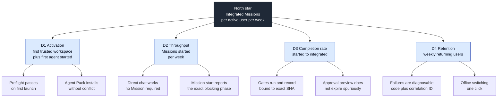

### 4.3 Release-readiness goals (gating, must be met before v0.2.0 publication)

| ID | Goal | Measure | Current |
| --- | --- | --- | --- |
| G1 | Automated verification stays green | `tsc --noEmit` + full vitest suite + build + NSIS pack all pass | ✅ 49 files / 435 tests / 0 failures |
| G2 | Zero production dependency vulnerabilities | `npm audit --omit=dev` | ✅ 0 |
| G3 | Installed-app matrix passes | Phase 4 matrix in `WHAT-NEEDS-TO-BE-DONE.md` | ❌ not run |
| G4 | End-to-end update proven | Two published versions; older installed build downloads, installs, relaunches into newer | ❌ 0 releases published |
| G5 | Consistent Authenticode signing | Publisher certificate configured in electron-builder | ❌ unconfigured |
| G6 | ARM64 verified on ARM64 hardware | Packaged app launches and functions | ❌ unverified |
| G7 | Accessibility pass | Keyboard-only + screen-reader pass on Attention, Diagnostics, output, chat | ❌ not run |
| G8 | Display-scaling pass | Layout correct at 100 / 125 / 150 / 200 % | ❌ not run |
| G9 | Working tree committed | The 2026-08-16 repair, updater, and A/B/C work is committed and pushed | ❌ uncommitted |

### 4.4 Post-release outcome goals

| ID | Goal | Proposed measure | Baseline |
| --- | --- | --- | --- |
| G10 | Activation | ≥ 60 % of installs reach "first agent started in a trusted workspace" within the first session | [TODO: no telemetry] |
| G11 | Mission completion | ≥ 70 % of started Missions reach `completed` rather than being abandoned in `draft`/`blocked` | [TODO] |
| G12 | Diagnosability | 100 % of failed Mission actions surface a stable failure code or correlation ID — **0 generic messages** | Design target met in code; unverified in installed app |
| G13 | Integration safety | **0** integrations that are not fast-forward-only against the expected target SHA | Enforced by design; requires live proof |
| G14 | Guard efficacy | **0** successful role-boundary bypasses in the regression suite | ✅ every known bypass has coverage |

> ⚠️ **Measurement gap.** G10–G11 require product telemetry that Council does not have and, per the local-trust positioning, may deliberately never have. See Chapter 11 and Chapter 14, OI-4.

---

## 5. Project Solution Overview

> 💡 **Methodology note:** Layered decomposition — trust boundary first, then data authority, then execution, then presentation. The trust boundary is stated first because in an Electron application it constrains every other decision.

### 5.1 Solution in one paragraph

Council runs an Electron main process that owns **every** CLI call and filesystem read. The renderer is sandboxed with context isolation and no Node access; a narrow preload bridge exposes typed IPC only. On top of that boundary, Council maintains four durable JSON stores under Electron `userData` — workspace registry, Claude session bindings, Codex thread bindings, worktree leases, and the Mission ledger — each with strict schemas, atomic same-directory replacement, revision checks, and last-known-good retention. Provider work runs in provider-owned sessions; Council records the exact commit and tree SHA of each handoff, runs Test and Review in detached worktrees, and permits integration only as a fast-forward against an approved single-use fingerprint.

### 5.2 Layer map

| Layer | Owns | Key modules |
| --- | --- | --- |
| **Presentation** | Office scene, Agents, Council, Missions, Diagnostics views | `src/ui/renderer/` |
| **Trust boundary** | Typed IPC, validation, privileged composition | `src/ui/preload.cjs`, `src/ui/ipc.ts`, `src/ui/ipcValidation.ts`, `src/ui/missionController.ts` |
| **Application** | Electron main, lifecycle, updater, diagnostics journal | `src/ui/main.ts`, `src/ui/appUpdater.ts`, `src/ui/serializedLifecycle.ts`, `src/ui/diagnosticJournal.ts` |
| **Supervision** | Catalog resolution, exact bindings, journaled launches | `src/supervisor/` |
| **Mission authority** | Ledger, coordinator, gates, git adapter, projection | `src/missions/` |
| **Orchestration** | Worktree leases and ownership journals | `src/orchestration/worktrees/` |
| **Provider** | Claude adapter, Codex App Server client, thread bindings | `src/providers/`, `src/integration/claudeProviderAdapter.ts` |
| **Integration runtime** | CLI exec/locate/classify, parsers, watchers, hooks, PTY, preflight | `src/integration/` |
| **Git authority** | argv-only semantic Git process layer | `src/git/` |
| **Enforcement** | PowerShell runtime guards | `scripts/gates/` |

### 5.3 State reconciliation strategy

Three mechanisms, deliberately layered by latency:

| Mechanism | Latency | Role |
| --- | --- | --- |
| Hooks (authenticated localhost receiver) | milliseconds | Fast path. Schedules a refresh; never mutates UI state directly. |
| Filesystem watches (`chokidar`) | sub-second | Catches state changes the CLI did not announce. |
| `claude agents --json --all` polling | `pollIntervalMs`, default 10 000 | Reconciles drift. The CLI remains authoritative. |

### 5.4 Durable stores

| File (under Electron `userData`) | Authority for |
| --- | --- |
| `app-config.json` | Trusted workspace registry, active workspace, user-definition inclusion |
| `session-bindings.json` | Exact profile → Claude session ownership, plus in-flight launch journaling |
| `codex-thread-bindings.json` | Exact profile → Codex thread ownership |
| `worktree-leases.json` | Writer and detached-gate worktree ownership journals |
| `mission-ledger.json` | Missions, tasks, leases, executions, handoffs, candidates, gates, approvals, event log |

All five use strict schemas, atomic same-directory replacement, revision checks where applicable, and last-known-good retention after malformed edits or unexpected deletion.

---

## 6. Project Scope

> 💡 **Methodology note:** MoSCoW against the as-built baseline. "Shipped" here means present in the working tree with automated verification; it does **not** mean verified in the installed application unless stated.

### 6.1 In scope — shipped

| ID | Capability | Verification state |
| --- | --- | --- |
| S1 | Trusted workspace selection, explicit trust confirmation, saved workspace registry | Automated ✅ |
| S2 | Precedence-aware agent catalog with shadowing chain and fingerprints | Automated ✅ |
| S3 | Exact durable Claude session bindings with launch journaling | Automated ✅ |
| S4 | Start / stop / resume / start-new / clear-binding / wake for individual agents | Live ✅ |
| S5 | Start-with-message and PTY-backed messaging to an exact idle/working session | Automated ✅, installed ❌ |
| S6 | Flat background-session roster with separate liveness column | Automated ✅ |
| S7 | Council Review pipeline (lead → 5 advisors → anonymized peer review → chairman) | Live ✅ (one completed review) |
| S8 | Council result envelope, state projection, copy/transcript controls | Automated ✅, installed ❌ |
| S9 | Provider-neutral Mission ledger with strict atomic authority | Automated ✅ |
| S10 | Worktree leases: strict writer + detached gate ownership | Automated ✅ (real-Git, NTFS) |
| S11 | Exact clean-commit handoffs | Automated ✅ |
| S12 | Allowlisted independent Test and Review gates | Automated ✅ |
| S13 | Fast-forward-only integration behind exact single-use approval | Automated ✅ |
| S14 | Structured Mission failure codes, correlation IDs, redacted bounded journal | Automated ✅ |
| S15 | Typed issue model driving Attention + Diagnostics | Automated ✅ |
| S16 | Bounded, ANSI-stripped recent-output rendering with reload/copy | Automated ✅ |
| S17 | Windows launch preflight (PowerShell, Git Bash, Git, Node, guard self-test, PTY, supervisor) | Live ✅ |
| S18 | Safe supervisor recovery via `daemon stop --any --keep-workers` | Automated ✅ |
| S19 | PowerShell runtime guards with role write policies and construct guard | Automated ✅ incl. junction test |
| S20 | Story gate: PRD traceability + acceptance execution in fresh non-interactive PowerShell | Automated ✅ |
| S21 | Repository Agent Pack preview/install with versioned manifest, conflict refusal | Automated ✅, installed ❌ |
| S22 | Saved Office switching by opaque workspace ID, single active runtime | Automated ✅, installed ❌ |
| S23 | Codex App Server stdio client, auth status, exact thread bindings, turns, approvals | Live ✅ (handshake) |
| S24 | Packaged Codex discovery incl. VS Code / VS Code Insiders extension layouts | Probe ✅ |
| S25 | Snapshot-driven paged pixel-office scene, 5 workstations per page, `V` toggle | Automated ✅ |
| S26 | NSIS per-user installer, x64 + ARM64, install-dir chooser, shortcuts | Build ✅ |
| S27 | Manual in-app update check / download / confirmed install / orderly relaunch | Automated ✅, e2e ❌ |
| S28 | Tag-only draft GitHub Release workflow with tag/version equality check | Config ✅, unexercised |
| S29 | Single-instance lock and serialized shutdown draining watchers, worktrees, Codex | Automated ✅ |

### 6.2 In scope — planned (must / should)

| ID | Capability | Priority | Source |
| --- | --- | --- | --- |
| R1 | Run the full Phase 4 installed-app matrix | Must | `WHAT-NEEDS-TO-BE-DONE.md` Phase 4 |
| R2 | Manual in-place install of 0.2.0 over 0.1.0 (one-time bootstrap) | Must | Updater section |
| R3 | Publish two incrementing signed test versions and prove update e2e | Must | Phase 4 |
| R4 | Configure consistent Authenticode signing | Must | `docs/updates.md` § Signing |
| R5 | Mission abandoned-draft reset + live retry validation | Should | Phase 1.3 |
| R6 | Agent Pack update/uninstall with backup restoration | Should | Phase 2.2 |
| R7 | User-selected Codex executable override/picker + attempted-location history | Should | Phase 3.2 |
| R8 | Per-workspace UI preference restoration + inactive-office activity summaries | Should | Phase 3.1 |
| R9 | App-supplied scope for internal Council definitions across repositories | Should | Phase 2.2 |
| R10 | Resolve the public-repo / `UNLICENSED` conflict | Must | This PRD, OI-1 |

### 6.3 Out of scope for this release (won't)

| ID | Item | Gating condition |
| --- | --- | --- |
| X1 | Concurrent windows / multiple simultaneous workspace runtimes | Blocked until **every** IPC request carries and validates an exact workspace ID and runtime-registry isolation tests pass |
| X2 | macOS or Linux support | Positioning decision; `DECAGRAM_COUNCIL_ALLOW_NON_WINDOWS_DEV=1` is a diagnostics escape hatch only |
| X3 | Cloud/hosted orchestration, shared team state, multi-user accounts | Local-trust positioning |
| X4 | Automatic update download or install-on-quit | Deliberate |
| X5 | Auto-start of discovered agents or providers | Deliberate |
| X6 | Destructive Agent Pack uninstall | Current installer is intentionally idempotent and non-destructive |
| X7 | Experimental team/task file parsers as a supported surface | Needs fresh shape capture first |

### 6.4 Dependency scope

| Dependency | Version / constraint | Failure mode if absent |
| --- | --- | --- |
| Claude Code CLI | ≥ 2.1.233 | Preflight reports; agent features unavailable |
| Codex CLI / App Server | Optional | Claude-only Missions remain available |
| PowerShell | Required | Guards and story gate cannot run |
| Git for Windows | Required | Worktrees, handoffs, integration unavailable |
| `node-pty` | Optional native module | Degrades to logs-only; direct replies unavailable |
| Node.js | ≥ 20.11 (development only) | — |
| `electron-updater` | ^6.8.9 | Update flow unavailable |
| `js-yaml` | Overridden to ≥ 4.3.1 | CVE-2026-59870 in 4.3.0 |

---

## 7. Project Risks

> 💡 **Methodology note:** Risks are scored on likelihood × impact and each carries a *named owner action*, not a generic mitigation. Risks the repository already mitigates are listed with their mitigation so the residual risk is visible.

### 7.1 Risk register

| ID | Risk | L | I | Mitigation in place | Residual action |
| --- | --- | --- | --- | --- | --- |
| RK1 | **Uncommitted working tree.** The repair pass, updater, and A/B/C briefs exist only locally. A disk failure loses ~3 major workstreams. | Med | **Critical** | None | **Commit and push immediately.** Highest-urgency item in this PRD. |
| RK2 | **Provider CLI drift.** Claude Code and Codex are research-preview surfaces; parsers are pinned to 2.1.233 / `0.148.0-alpha.9`. | **High** | High | Pass-through of unknown `waitingFor`; unrecognized daemon prose → **Unknown**; failures classified by anchored output, not exit codes | Establish a re-probe cadence per provider release; add a version-drift diagnostic card |
| RK3 | **Single-maintainer bus factor.** | Med | High | Extensive documentation and 435 tests | [TODO: succession / contributor plan] |
| RK4 | **Unsigned installer.** Windows SmartScreen will warn; publisher reputation starts at zero. | **High** | High | GitHub HTTPS + SHA-512 in `latest.yml` protect transport and integrity only | Acquire and configure an Authenticode certificate (R4) |
| RK5 | **Installed app diverges from tests.** The live Council transcript existed in the provider session but the installed UI failed to surface it — proving automated green ≠ installed correctness. | Med | High | Phase 0/1 repair pass implemented | Run the Phase 4 matrix (R1) |
| RK6 | **Guards are not a security boundary.** Explicitly construct-level. A determined agent or a novel Claude tool event may fall outside coverage. | Med | Med | Fail-closed on unexpected guarded-child exits; junction-aware containment; every known bypass has regression coverage | Document the boundary in user-facing material, not only in `scripts/gates/README.md` |
| RK7 | **Concurrent-window race.** Removing the single-instance lock prematurely would create cross-workspace watcher, binding, provider, and IPC corruption. | Low | **Critical** | Single-instance lock retained; concurrency explicitly blocked | Keep X1 blocked until isolation tests pass |
| RK8 | **Approval expiry friction.** Any intervening Mission mutation expires the integration preview. Correct, but may feel arbitrary under real concurrency. | Med | Med | Approval revision recorded on the journal | Ensure the UI explains *what* changed, not merely that the preview expired |
| RK9 | **ARM64 unverified.** ARM64 payload builds but has never run on ARM64 hardware. | Med | Med | Build succeeds | Acquire ARM64 test hardware (G6) |
| RK10 | **Licensing blocks adoption.** Public repo + `UNLICENSED` grants no rights. | **High** | High | None | Choose and apply a license (R10) |
| RK11 | **Codex discovery fragility.** Discovery depends on bounded scans of VS Code extension directories whose layout is vendor-controlled. | Med | Med | Multiple discovery classes; `vscode-extension` source reported | Ship the user override picker (R7) |
| RK12 | **Category velocity.** At least ten competing orchestrators are actively developed. | **High** | Med | Windows-first + ledger/gate differentiation | Ship a release; an unpublished product has no position |

### 7.2 Top three by expected loss

1. **RK1** — trivially preventable, catastrophic if it lands.
2. **RK4 + RK10 together** — the product is undistributable in practice until both are resolved.
3. **RK2** — the permanent cost of the category; determines long-run maintenance viability.

---

## 8. Terminology

| Term | Definition |
| --- | --- |
| **Decagram Council** | The product and runtime name. Package identity `com.decagram.council`. |
| **council** (lowercase) | Reserved for the actual Council Review feature and its durable Git namespace `refs/council/*`. Persisted data, not a branding alias. |
| **Office** | A trusted workspace/repository as presented in the UI, plus its scene view. |
| **Workspace** | A user-selected, explicitly trusted repository, identified by opaque `ws_<uuid-v4>`. |
| **Profile** | A configured or discovered agent launch profile (`RosterMember`) — label, agent name, cwd, model, effort, ordering. |
| **Catalog** | The precedence-resolved inventory of agent definitions visible from a workspace (project → ancestor → user scope), with fingerprints and shadowing chains. |
| **Definition fingerprint** | A hash of an agent definition, recorded so a launch can be proven to match what the user previewed. |
| **Binding** | Exact, app-owned ownership of a provider session by a profile. Keyed by durable session id, never by CWD, PID, label, or agent name. |
| **Session state** | Provider-reported lifecycle: `working`, `blocked`, `done`, `failed`, `stopped`, plus transitional `starting`, `resuming`, `adopted`, `crashed`, and `running`. |
| **Process liveness** | Whether the supervisor currently hosts a process. A **separate axis** from session state; `cold` marks no hosted process. |
| **Mission** | A Council-owned unit of work: objective, tasks, assignments, handoffs, gates, and an integration outcome. |
| **Mission task** | One assignable unit within a Mission, with dependencies, an assignee profile, a lease, and an execution. |
| **Worktree lease** | Exclusive ownership of a Git worktree by one execution, with branch name, canonical path, base commit SHA, and base tree SHA. |
| **Handoff** | An exact clean-commit record: base commit SHA, commit SHA, tree SHA, summary, evidence, risks. |
| **Integration candidate** | An ordered set of handoffs proposed for a target ref, pinned to a commit and tree SHA. |
| **Gate** | An independent Test or Review execution bound to an exact commit/tree SHA, with a gate policy fingerprint and a distinct executor. |
| **Integration approval** | A single-use record carrying the preview digest, expected target commit/tree SHA, both gate IDs, and the approval revision. Expires on any intervening ledger mutation. |
| **Council Review** | The five-advisor → anonymized peer review → chairman verdict pipeline. |
| **Advisor** | One of five read-only council members: contrarian, first-principles, expansionist, outsider, executor. |
| **`COUNCIL MEMBER SIGN-OFF`** | The exact required final line of every advisor response. |
| **Agent Pack** | The installable bundle of specialist + Council definitions, PowerShell guard scripts, and settings hook merges, tracked by a versioned manifest. |
| **Preflight** | Windows launch diagnostics run before the app is considered ready. |
| **Story gate** | The `TaskCompleted` / `TeammateIdle` hook enforcing PRD traceability, acceptance execution, and git-visible path ownership. |
| **Snapshot** | The single reconciled state object produced by poll + watch + hooks and rendered by the UI. |

---

## 9. References

### 9.1 Internal (repository)

| Document | Role |
| --- | --- |
| `README.md` | Architecture, status table, verified integration assumptions, naming policy |
| `WHAT-WAS-DONE.md` | Completion record with command evidence and explicit non-claims |
| `WHAT-NEEDS-TO-BE-DONE.md` | Phase 0–4 action plan ordered by user impact and dependency |
| `VERIFICATION.md` | Verification evidence ledger |
| `docs/cli-surface.md` | Windows Claude Code 2.1.233 CLI probe transcript |
| `docs/windows-parser-audit.md` | Parser audit against Windows output |
| `docs/updates.md` | Release, versioning, signing, publication process |
| `docs/codex-milestone-02-completion-report.md` | Historical Milestone 2 record — **not** a current parity ledger |
| `scripts/gates/README.md` | Exact guard boundary and write policies |
| `claude-code-agent-pack/` | Distributable specialist definitions and templates |

### 9.2 External

| Source | Use |
| --- | --- |
| Claude Code CLI 2.1.233 (Windows) | Integration surface of record |
| Codex App Server `0.148.0-alpha.9` | Provider protocol of record |
| electron-builder / `electron-updater` ^6.8.9 | NSIS packaging and update state machine |
| CVE-2026-59870 (`js-yaml` 4.3.0) | Drove the `js-yaml` ≥ 4.3.1 override |

### 9.3 Competitive references

Third-party comparisons consulted for Chapter 3, pending first-party verification: [9 Open-Source Agent Orchestrators for AI Coding (2026)](https://www.augmentcode.com/tools/open-source-agent-orchestrators); [Claude Code Orchestration Tools, Compared](https://munderdiffl.in/blog/claude-code-orchestration-tools-compared/); [Best Multi-Agent Coding Tools for Claude Code and Codex Users (2026)](https://nimbalyst.com/blog/best-multi-agent-coding-tools-2026/); [The Best Tools to Run Multiple Coding Agents in 2026](https://agentsroom.dev/blog/best-multi-agent-coding-tools).

---
## 10. Functional Requirements

> 💡 **Methodology note:** This chapter is organised framework-first: architecture → data model → primary business process → state machines → feature inventory, and only then module-by-module detail. Every requirement carries a stable ID (`FR-<module>-<n>`) so stories and reviews can cite it, and a `Source:` line so the claim is auditable.

### 10.1 Product Framework Overview

#### 10.1.1 Application architecture

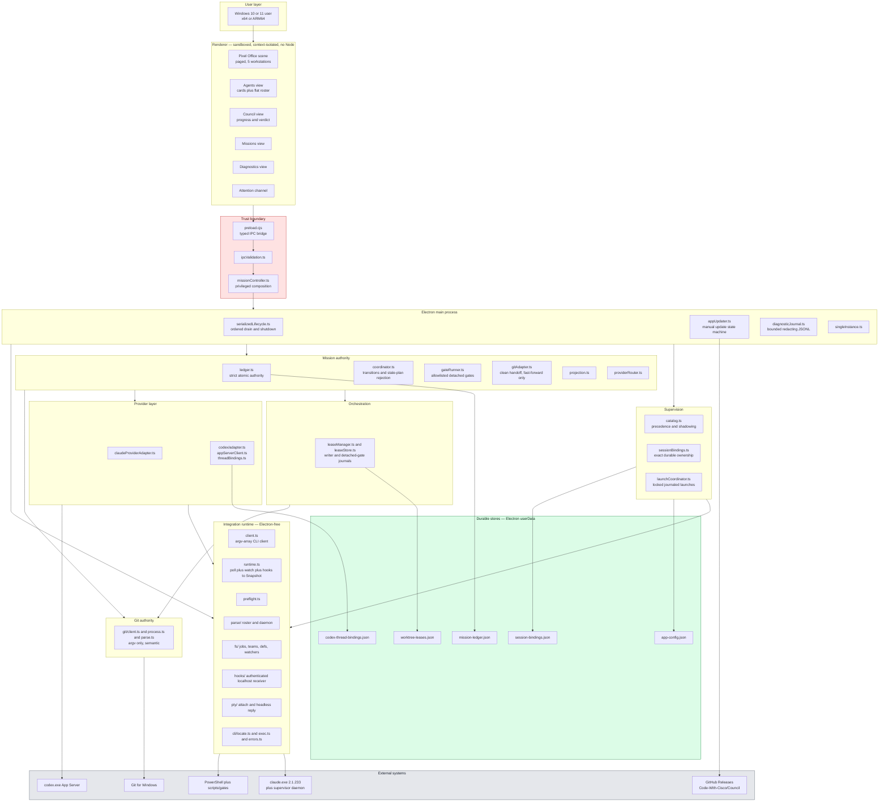

**Boundary rules (binding):**

| Rule | Statement |
| --- | --- |
| B1 | The main process owns **every** CLI call and filesystem read. The renderer performs none. |
| B2 | The renderer is sandboxed, has context isolation enabled, and has no Node access. |
| B3 | Raw network, updater, and provider errors never cross into the renderer. Only safe, bounded, typed shapes do. |
| B4 | Technical failure detail goes to a bounded, secret-redacting local JSONL journal; the renderer receives a correlation ID. |
| B5 | The `src/integration/` layer is Electron-free and independently testable. |

*Source: `README.md` § Application; `src/ui/preload.cjs`; `src/ui/ipcValidation.ts`; `src/ui/diagnosticJournal.ts`.*

#### 10.1.2 Data model (ER)

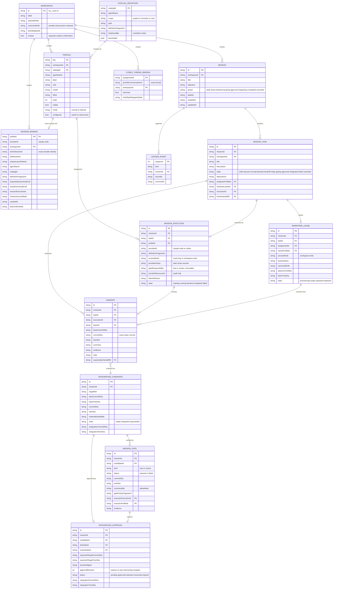

*Source: `src/missions/types.ts`, `src/config/appConfig.ts`, `src/integration/types.ts`, `src/providers/missionContracts.ts`.*

#### 10.1.3 Primary business process — Mission lifecycle

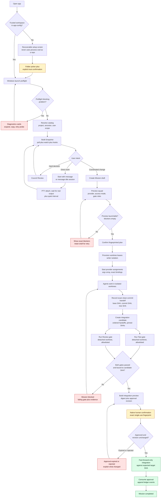

#### 10.1.4 State machine — Mission phase

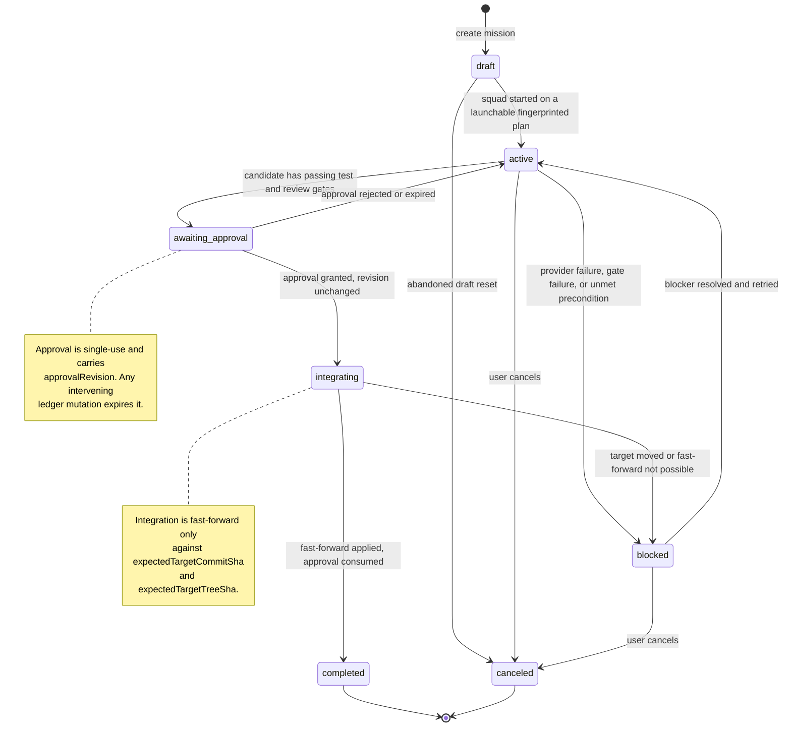

*State names in the diagram use underscores because Mermaid state IDs cannot contain hyphens; the canonical values are `awaiting-approval` and the rest as listed in §10.1.2.*

| From | To | Trigger | Guard |
| --- | --- | --- | --- |
| `draft` | `active` | Start Squad | Preview `blockers` empty; every participant `launchable`; ledger revision matches the previewed revision |
| `active` | `blocked` | Provider/gate/precondition failure | Failure code recorded; correlation ID issued for unexpected errors |
| `active` | `awaiting-approval` | Preview integration | Candidate exists; a `passed` test gate **and** a `passed` review gate bound to the candidate's commit and tree SHA |
| `awaiting-approval` | `integrating` | Native approval confirmation | `approvalRevision` equals current ledger revision; approval `status = approved`; digest matches |
| `awaiting-approval` | `active` | Rejection or expiry | Any intervening mutation expires the approval |
| `integrating` | `completed` | Fast-forward applied | Target ref still at `expectedTargetCommitSha` / `expectedTargetTreeSha` |
| `integrating` | `blocked` | Target moved | Non-fast-forward is refused, never forced |

#### 10.1.5 State machine — Mission task

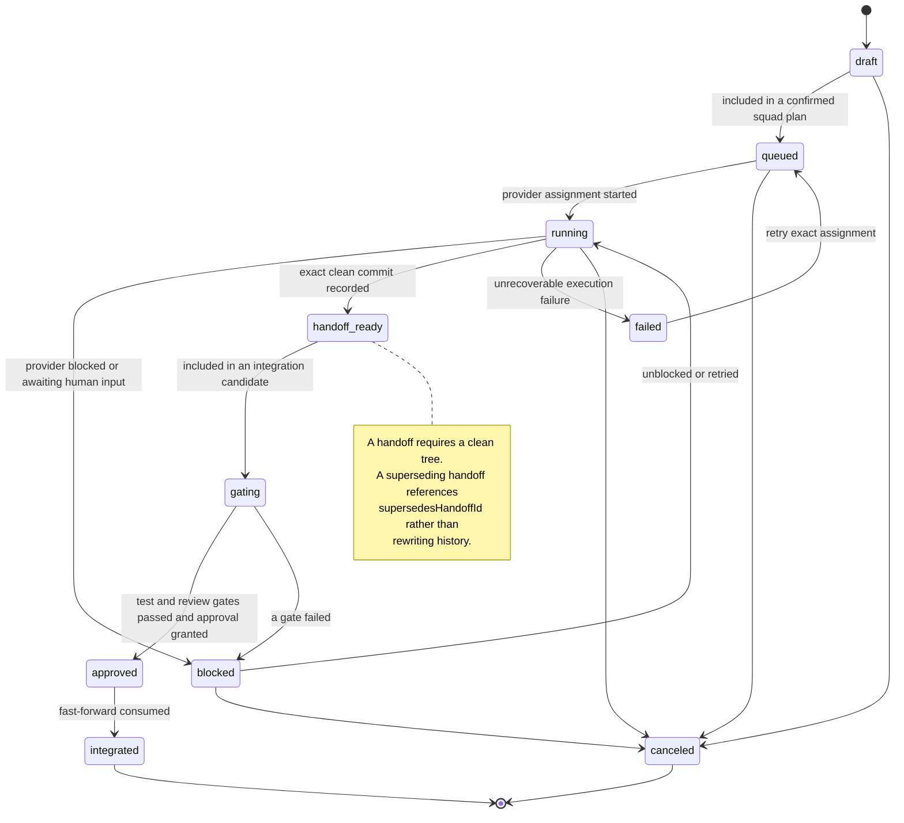

#### 10.1.6 State machine — Claude session and process liveness

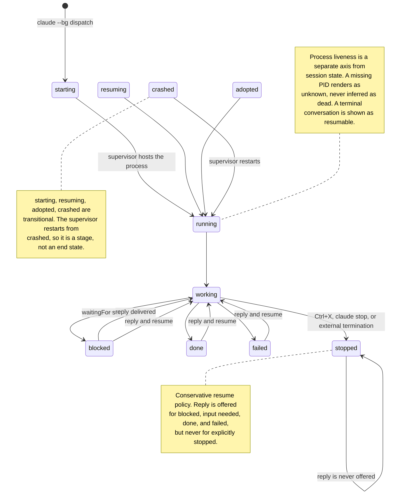

*Source: `src/integration/types.ts` (`SessionState`, `TRANSITIONAL_SESSION_STATES`, `Session.cold`); `WHAT-WAS-DONE.md` § conservative resume policy.*

#### 10.1.7 State machine — Council Review

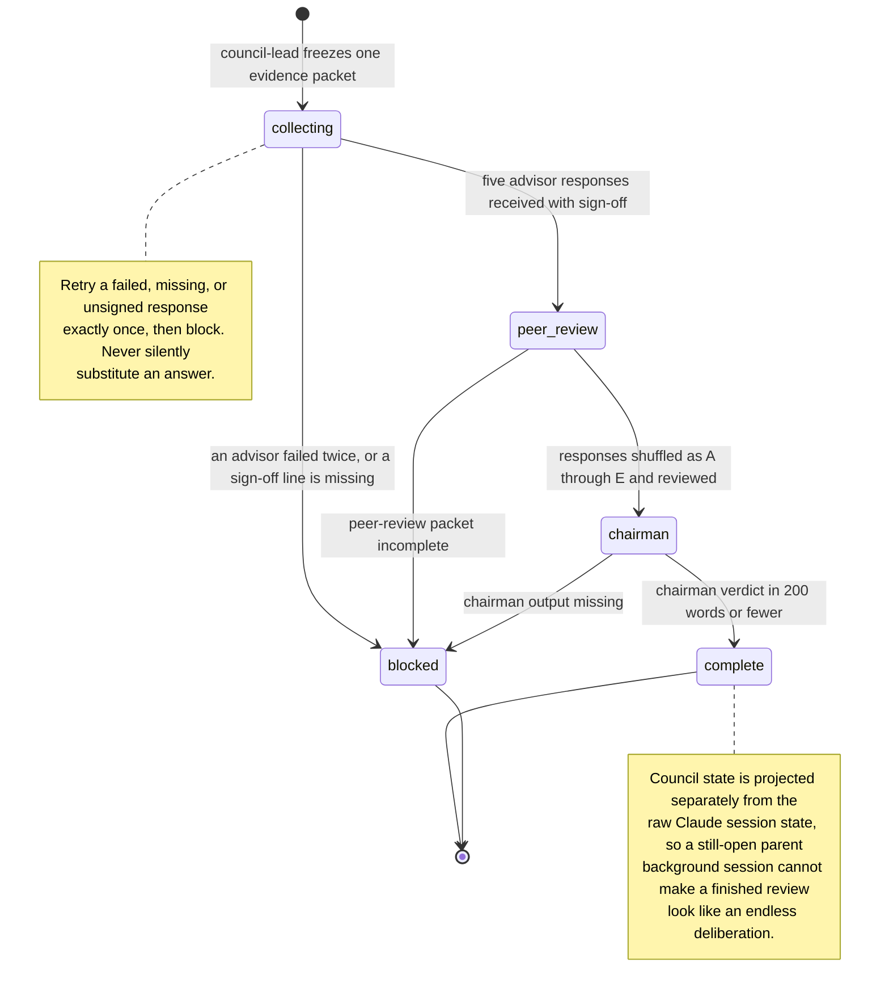

#### 10.1.8 State machine — application update

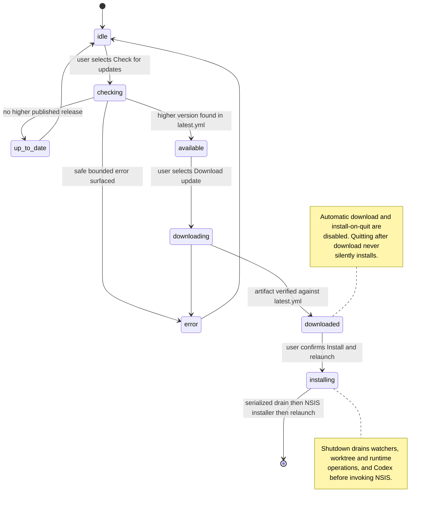

#### 10.1.9 Feature list

| ID | Feature | Module | Priority | State |
| --- | --- | --- | --- | --- |
| F01 | First-run setup and explicit workspace trust | Workspace | P0 | Shipped |
| F02 | Saved Office switching by workspace ID | Workspace | P1 | Shipped, installed-unverified |
| F03 | Windows launch preflight | Diagnostics | P0 | Shipped |
| F04 | Interactive Diagnostics cards | Diagnostics | P0 | Shipped |
| F05 | Safe supervisor recovery | Diagnostics | P1 | Shipped |
| F06 | Precedence-aware catalog with shadowing chain | Catalog | P0 | Shipped |
| F07 | Roster preferences v1 read / v2 explicit save | Catalog | P1 | Shipped |
| F08 | Agent cards + flat background-session roster | Agents | P0 | Shipped |
| F09 | Start / stop / resume / start-new / clear-binding / wake | Agents | P0 | Shipped |
| F10 | Start with message | Agents | P0 | Shipped, installed-unverified |
| F11 | Message an exact active idle session (PTY) | Agents | P0 | Shipped, installed-unverified |
| F12 | Bounded ANSI-stripped recent output with reload/copy | Agents | P0 | Shipped, installed-unverified |
| F13 | Attention channel — all items, navigable, keyboard-accessible | Attention | P0 | Shipped, installed-unverified |
| F14 | Council Review pipeline | Council | P1 | Shipped, live-proven once |
| F15 | Council result envelope and state projection | Council | P0 | Shipped, installed-unverified |
| F16 | Mission draft creation | Missions | P0 | Shipped |
| F17 | Squad preview with provider, access mode, gate roles | Missions | P0 | Shipped |
| F18 | Fingerprinted squad start with worktree leases | Missions | P0 | Shipped |
| F19 | Exact clean-commit handoff recording | Missions | P0 | Shipped |
| F20 | Integration candidate creation | Missions | P0 | Shipped |
| F21 | Independent allowlisted Test and Review gates | Missions | P0 | Shipped |
| F22 | Integration preview and native single-use approval | Missions | P0 | Shipped |
| F23 | Fast-forward-only integration | Missions | P0 | Shipped |
| F24 | Structured Mission failures with correlation IDs | Missions | P0 | Shipped |
| F25 | Mission refresh reporting changed / unchanged / failed | Missions | P0 | Shipped |
| F26 | Mission abandoned-draft reset | Missions | P1 | **Planned** |
| F27 | Repository Agent Pack preview and install | Agent Pack | P1 | Shipped, installed-unverified |
| F28 | Agent Pack update / uninstall with backup restore | Agent Pack | P1 | **Planned** |
| F29 | App-supplied scope for internal Council definitions | Agent Pack | P1 | **Planned** |
| F30 | PowerShell write and shell guards | Guards | P0 | Shipped |
| F31 | Story gate — traceability, acceptance, path ownership | Guards | P0 | Shipped |
| F32 | Guard self-test during preflight | Guards | P0 | Shipped |
| F33 | Codex App Server client, auth, threads, turns, approvals | Codex | P1 | Shipped, handshake-proven |
| F34 | Codex discovery incl. VS Code extension layouts | Codex | P1 | Shipped, probe-proven |
| F35 | User-selected Codex executable override | Codex | P1 | **Planned** |
| F36 | Paged pixel-office scene with `V` toggle | Office | P2 | Shipped |
| F37 | Per-workspace UI preference restoration | Office | P2 | **Planned** |
| F38 | Manual in-app update check / download / install | Updates | P2 | Shipped, e2e-unproven |
| F39 | Tag-only draft GitHub Release workflow | Release | P2 | Configured, unexercised |
| F40 | Single instance and serialized shutdown | Lifecycle | P0 | Shipped |
| F41 | Concurrent windows | Lifecycle | — | **Blocked** (X1) |

---

### 10.2 Product Requirement Details

#### 10.2.1 Module — Workspace and Office

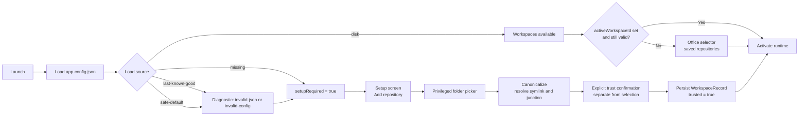

| ID | Requirement | Priority |
| --- | --- | --- |
| FR-WS-1 | On first run the packaged app **must not** use its process working directory as a repository. It stays in a recoverable setup screen until the user chooses and trusts a folder. | P0 |
| FR-WS-2 | Workspace selection and workspace **trust** are two separate acts. `trusted` is set only by an explicit confirmation after selection. | P0 |
| FR-WS-3 | Each workspace stores both `selectedPath` (as the user chose it, retained for a useful display and retry) and `canonicalPath` (filesystem-resolved, including symlink and junction resolution). | P0 |
| FR-WS-4 | Workspace IDs are opaque `ws_<uuid-v4>` and are the only key used to scope catalogs, bindings, Missions, worktrees, and attention. Paths are never the scoping key. | P0 |
| FR-WS-5 | A malformed or unreadable `app-config.json` retains last-known-good, reports a typed diagnostic (`invalid-json`, `invalid-config`, `read-error`), and never silently discards trusted workspaces. | P0 |
| FR-WS-6 | The Office selector lists saved repositories with recent status, active agents, attention count, and last-opened time, and switches by workspace ID **without** reopening the folder picker. | P1 |
| FR-WS-7 | Activating a workspace disposes the prior runtime and preserves workspace-scoped bindings and Mission state. Switching repositories never moves or rebinds an existing session. | P0 |
| FR-WS-8 | Only one runtime is active at a time. When inactive offices still have provider sessions running, that must be shown, not hidden. | P0 |
| FR-WS-9 | Opening a trusted workspace does **not** create or migrate `roster.json`. Version-1 files are normalized in memory only; version 2 is written only by an explicit preference save. | P0 |
| FR-WS-10 | Per-workspace UI preferences (selected agent, Office page, Mission view, filters) are restored on switch. | P2 — **Planned** |

*Source: `src/config/appConfig.ts`; `README.md` § Agent discovery and roster preferences; `WHAT-NEEDS-TO-BE-DONE.md` § 3.1.*

#### 10.2.2 Module — Catalog and profiles

| ID | Requirement | Priority |
| --- | --- | --- |
| FR-CAT-1 | Effective definitions visible from the selected project's `.claude/agents/` hierarchy **and** the user Claude configuration are merged into the live catalog as on-demand profiles. | P0 |
| FR-CAT-2 | Each catalog entry records scope (`project` / `ancestor` / `user`), the winning path, a `definitionFingerprint`, `launchable`, and the full `shadowedBy` chain. | P0 |
| FR-CAT-3 | Saved roster members remain **overrides only** — label, prompt, model, effort, ordering, visibility. They do not define the agent. | P0 |
| FR-CAT-4 | Because an unknown `--agent` warns and silently starts a *default* agent rather than failing, every definition **must** be validated against disk before dispatch. | P0 |
| FR-CAT-5 | A same-tier conflict with no effective winner reports `candidatePaths` and is not launchable. | P0 |
| FR-CAT-6 | A malformed edit retains last-known-good profiles, blocks overwrite, and surfaces a visible diagnostic. | P0 |
| FR-CAT-7 | Definition/profile watcher failure retains the last-known-good catalog and blocks **new** definition-based launches, while exact already-bound lifecycle actions remain available. | P0 |
| FR-CAT-8 | Newly discovered definitions and providers are **never** started automatically. | P0 |

#### 10.2.3 Module — Agents, sessions, and bindings

| ID | Requirement | Priority |
| --- | --- | --- |
| FR-AG-1 | Profile ownership is app-owned and exact. Labels, agent names, CWD, and PID are **never** used to claim a Claude session. | P0 |
| FR-AG-2 | A launch is journaled in `session-bindings.json` **before** the process is spawned, so an uncertain acknowledgement can be reconciled after a crash. | P0 |
| FR-AG-3 | Session state and process liveness are separate axes. A terminal conversation is shown as *resumable*, not dead. A missing PID displays as **unknown**, never inferred as dead. | P0 |
| FR-AG-4 | All ten session states are handled, including the four transitional states (`starting`, `resuming`, `adopted`, `crashed`). An unrecognized state must never render as healthy. | P0 |
| FR-AG-5 | An unrecognized `waitingFor` value is passed through and rendered as text rather than dropped. | P0 |
| FR-AG-6 | **Conservative resume policy:** Reply is available for `blocked` / *input needed*, `done`, and `failed`, and is labelled "Send a reply and resume." Reply is **never** offered for explicitly `stopped` sessions, and explicitly stopped sessions are never silently restarted. | P0 |
| FR-AG-7 | **Start with message** accepts a bounded multiline initial prompt passed through the existing argv-safe launch transaction. All CLI invocation uses argument arrays without shell interpolation. | P0 |
| FR-AG-8 | **Message agent** targets an exact active binding reporting `working` / idle via the PTY attach path. PTY reply waits for real terminal output plus a quiet interval; a silent attach times out **without** sending user text. | P0 |
| FR-AG-9 | Direct conversations create no story and no Mission artifact. | P0 |
| FR-AG-10 | Recent output is stripped of ANSI, OSC, cursor, and unsafe control sequences; normalized for line endings; bounded to a tail; and rendered with explicit loading, empty, unavailable/cold-supervisor, loaded, reload, and copy states. No escape sequence reaches the DOM. | P0 |
| FR-AG-11 | A cold supervisor produces an actionable explanation, never a blank box. A stopped daemon is a normal resting state, not a fault. | P0 |
| FR-AG-12 | A failed roster read retains the previous roster and marks it **stale** rather than emptying the squad. | P0 |
| FR-AG-13 | Acceptance scenario: select Reviewer → start it with "Review this repository" → read the response → send a follow-up → close the app → resume the same exact session. | P0 |

#### 10.2.4 Module — Attention and Diagnostics

| ID | Requirement | Priority |
| --- | --- | --- |
| FR-AT-1 | One renderer-safe issue model covers session, catalog, binding, provider, Mission, and preflight problems: ID, severity, source, affected workspace/profile/Mission, summary, safe detail, destination, allowed remediation actions. | P0 |
| FR-AT-2 | The same issue has the **same ID and the same wording** in Attention and in Diagnostics. | P0 |
| FR-AT-3 | Attention lists **every** queued item, each as a keyboard-accessible control. Activating one navigates to the exact affected object, selects it, scrolls it into view, and focuses the appropriate control. | P0 |
| FR-AT-4 | Only actions valid for that issue are offered (Reply, Resume, Retry exact assignment, Clear stale binding, Re-run discovery, Open Diagnostics). UI navigation never mutates or infers a fix by itself. | P0 |
| FR-AT-5 | Human-blocked sessions share **one** amber attention channel; competing alert surfaces are not created. | P1 |
| FR-AT-6 | Resolving a condition removes its item after the authoritative refresh — not optimistically. | P0 |
| FR-AT-7 | Preflight reports PowerShell, Git Bash path, Git, Node, guard self-test, PTY capability, and supervisor reachability/version/workers/mismatch, plus raw diagnostics. | P0 |
| FR-AT-8 | Every warning/error Diagnostics card expands to safe detail and offers a useful next action (retry probe, refresh provider status, open the related issue, copy diagnostic, choose executable, show installation instructions). Healthy informational cards stay non-interactive. | P0 |
| FR-AT-9 | Cards include checked time, discovery method, resolved executable where safe, version, protocol/authentication state, and the last bounded failure. | P1 |
| FR-AT-10 | Refresh re-runs the privileged preflight rather than repainting stale state, and updates only the affected diagnostic. | P0 |
| FR-AT-11 | Unrecognized daemon prose renders as **Unknown** with the raw text retained. Manual PID termination is offered **only** when the parser actually returned a PID. | P0 |
| FR-AT-12 | Supervisor recovery uses `daemon stop --any --keep-workers`. | P1 |

#### 10.2.5 Module — Council Review

| ID | Requirement | Priority |
| --- | --- | --- |
| FR-CO-1 | The pipeline is: `council-lead` freezes one evidence packet → five read-only advisors analyze it independently → findings are shuffled as Responses A–E → advisors perform a structured peer review → the read-only chairman returns the final verdict in 200 words or fewer. | P1 |
| FR-CO-2 | The lead is started as a **main session** via `claude.exe --bg --agent council-lead ...` with arguments passed as an array, no shell interpolation. An ordinary subagent cannot spawn the advisor panel. | P1 |
| FR-CO-3 | The lead definition carries the exact advisor allowlist: `Agent(council-contrarian, council-first-principles, council-expansionist, council-outsider, council-executor, council-chairman)`. | P1 |
| FR-CO-4 | Every advisor response **must** end with the exact final line `COUNCIL MEMBER SIGN-OFF`. | P1 |
| FR-CO-5 | The lead coordinates only agents it spawns in its own session, retries a failed/missing/unsigned response exactly **once**, then blocks. It never silently substitutes an answer, and the failing advisor is exposed when this triggers. | P1 |
| FR-CO-6 | Advisors and the chairman are read-only (`tools: Read, Grep, Glob`). The chairman carries no `permissionMode`, so its read-only behavior depends on its tools rather than inherited mode behavior. | P0 |
| FR-CO-7 | Council state is projected **separately** from the raw Claude session state as `collecting` / `peer-review` / `chairman` / `complete` / `blocked`. A still-open parent background session must never make a finished review display as an endless deliberation. | P0 |
| FR-CO-8 | Completion requires validating five advisor sign-offs, the anonymized A–E mapping, chairman output, and retry history before an exact machine-readable completion marker and bounded result envelope are accepted. | P0 |
| FR-CO-9 | The final verdict surfaces automatically in the Council view without requiring "Load recent output," with Copy, View transcript, Start new Council, and Stop retained session actions. | P0 |
| FR-CO-10 | The projector recognizes both the new result envelope **and** the completed pre-envelope Chairman format, so already-finished transcripts resolve. | P1 |
| FR-CO-11 | Restarting Council restores the last completed result without relaunching the panel. | P1 |
| FR-CO-12 | Missing sign-off, missing chairman output, and a second advisor failure each resolve to an explicit `blocked` state naming the cause. | P0 |

*Source: `.claude/agents/council-lead.md`, `.claude/agents/council-chairman.md`, `.claude/skills/llm-council/SKILL.md`, `README.md` § Council Review, `WHAT-WAS-DONE.md` § B.*

#### 10.2.6 Module — Missions

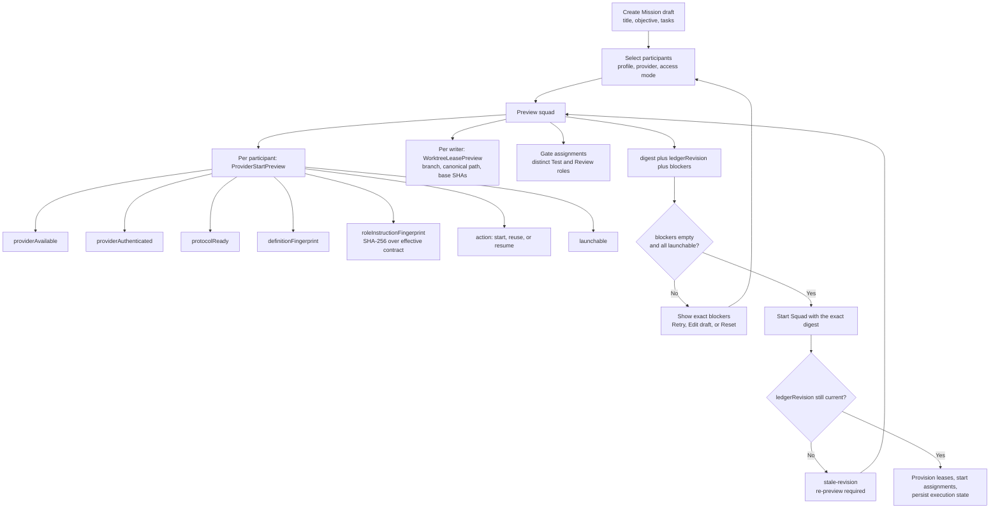

| ID | Requirement | Priority |
| --- | --- | --- |
| FR-MI-1 | The Mission ledger — not the provider session, repository story, or provider-native task list — is the authority for Council dispatch, handoffs, gates, and integration approval. Provider artifacts are **evidence**. | P0 |
| FR-MI-2 | The ledger is a strict versioned document (`version: 1`) with a monotonic `revision`, keyed record maps, and an append-only `events` array of typed `MissionLedgerEvent`s. Writes are atomic same-directory replacements. | P0 |
| FR-MI-3 | Preconditions are surfaced **before** Start is enabled: clean repository requirement, provider readiness/authentication, launchable definition fingerprint, distinct Test/Review roles, gate policy, and current ledger revision. | P0 |
| FR-MI-4 | The squad preview is fingerprinted by `digest` and pinned to `ledgerRevision`. Starting against a stale plan is rejected with `stale-revision`. | P0 |
| FR-MI-5 | `roleInstructions` are bounded by `MAX_PREVIEW_ROLE_INSTRUCTIONS` (24 000). Exceeding the bound makes the preview **non-launchable** rather than truncating the contract silently. | P0 |
| FR-MI-6 | `gateResponsibility` is selected in the fingerprinted plan and is **immutable** on the execution record thereafter. | P0 |
| FR-MI-7 | A failed action retains the failed step and its inputs for retry rather than clearing the form or returning a generic failure. The UI identifies exactly which phase blocked and offers Retry, Edit draft, or Reset. | P0 |
| FR-MI-8 | Every unexpected privileged Mission exception maps to a stable failure code — `ledger-blocked`, `provider-unavailable`, `stale-revision`, `invalid-assignment`, `worktree-failure`, `unexpected` — with a bounded renderer-safe explanation, a recommended next action, and a correlation ID plus Copy diagnostics for `unexpected`. | P0 |
| FR-MI-9 | Refresh visibly reports its check time, old/new revision, and whether anything changed. It must never appear to succeed silently: it says changed, unchanged, or failed. | P0 |
| FR-MI-10 | Refresh reconstructs the same durable state after application restart. | P0 |
| FR-MI-11 | An explicit **Reset abandoned draft** action exists, behind confirmation. | P1 — **Planned** |
| FR-MI-12 | Acceptance: a minimal Claude-only Mission starts in a disposable repository and reaches `integrated`. | P0 — **not yet verified live** |

#### 10.2.7 Module — Worktree leases

| ID | Requirement | Priority |
| --- | --- | --- |
| FR-WT-1 | Each writer execution holds an exclusive lease recording branch name, canonical path, `baseCommitSha`, and `baseTreeSha`. Lease `accessMode` is always `workspace-write`. | P0 |
| FR-WT-2 | Lease state is `provisioning` → `ready` → `released`, with `orphaned` for a lease whose owner is gone. Orphaned leases are surfaced, never silently reclaimed. | P0 |
| FR-WT-3 | Gate executions run in **detached** worktrees, separate from any writer lease, so a gate cannot be influenced by an in-progress writer. | P0 |
| FR-WT-4 | Worktree path containment follows Windows junction/reparse targets **segment by segment**. Containment is verified against the canonical path, not the selected path. | P0 |
| FR-WT-5 | Lease ownership is journaled in `worktree-leases.json` with strict schema, atomic replacement, and last-known-good retention. | P0 |
| FR-WT-6 | Git access is argv-only and semantic; no shell string is ever constructed. | P0 |

#### 10.2.8 Module — Handoffs, gates, and integration

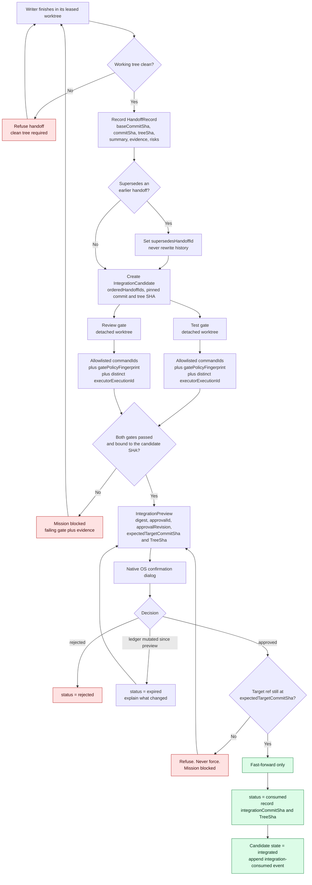

| ID | Requirement | Priority |
| --- | --- | --- |
| FR-IN-1 | A handoff requires an exact **clean** commit and records `baseCommitSha`, `commitSha`, `treeSha`, `summary`, `evidence[]`, and `risks[]`. | P0 |
| FR-IN-2 | A corrected handoff references `supersedesHandoffId`. History is never rewritten and prior handoffs are never deleted. | P0 |
| FR-IN-3 | A gate record binds `kind` (`test` \| `review`), `status`, the candidate's `commitSha` and `treeSha`, allowlisted `commandIds`, a `gatePolicyFingerprint`, and both `executorExecutionId` and `executorProfileId`. | P0 |
| FR-IN-4 | Test and Review gate executors **must be distinct roles**, chosen in the fingerprinted plan. An implementing agent cannot certify its own work. | P0 |
| FR-IN-5 | Gates run only allowlisted commands, in detached worktrees. | P0 |
| FR-IN-6 | Integration requires exactly one `passed` test gate and one `passed` review gate bound to the candidate's commit and tree SHA. | P0 |
| FR-IN-7 | `IntegrationApproval` records `previewDigest`, `expectedTargetCommitSha`, `expectedTargetTreeSha`, both gate IDs, and `approvalRevision` — the exact ledger revision produced by inserting the journal. | P0 |
| FR-IN-8 | Any intervening Mission mutation **expires** the preview before approval can authorize work. Approval status moves `pending` → `approved` \| `rejected` \| `expired` → `consumed`. | P0 |
| FR-IN-9 | Approval is granted through a **native confirmation** on the exact single-use fingerprint. | P0 |
| FR-IN-10 | Integration is **fast-forward only** against the expected target commit and tree SHA. A moved target is refused, never forced. | P0 |
| FR-IN-11 | On success the approval is consumed, `integrationCommitSha` / `integrationTreeSha` are recorded, the candidate becomes `integrated`, superseded candidates become `superseded`, and the corresponding ledger events are appended. | P0 |
| FR-IN-12 | When an approval expires, the UI explains **what changed**, not merely that the preview expired. | P1 |

#### 10.2.9 Module — Providers

| ID | Requirement | Priority |
| --- | --- | --- |
| FR-PR-1 | The provider boundary is neutral. `CouncilProviderId` is `claude-code` \| `codex`, and `MissionProviderStatus` reports `available`, `authenticated`, `persistentConversations`, `approvals`, and a `diagnostic`. Missions must not assume a provider's capabilities. | P0 |
| FR-PR-2 | Claude-only Missions remain fully available when Codex is absent. | P0 |
| FR-PR-3 | Council stores **no** provider credentials. Authentication state is read from the provider and reported, never cached as a secret. | P0 |
| FR-PR-4 | Codex threads are bound exactly in `codex-thread-bindings.json`. Council never selects a thread heuristically. | P0 |
| FR-PR-5 | One long-lived local Codex App Server connection is shared by the active runtime and initialized once. | P0 |
| FR-PR-6 | Codex readiness requires probing `codex --version`, starting the App Server, initializing, reporting auth/protocol state, and closing cleanly — **before** Mission readiness is declared. A prior verification closed the connection without deleting or archiving a thread. | P0 |
| FR-PR-7 | Codex discovery scans, in bounded fashion: PATH, selected ChatGPT locations, `.local`, npm packages, the app resources directory, and OpenAI VS Code / VS Code Insiders extension directories — choosing the newest matching Windows x64/ARM64 bundle and reporting `vscode-extension` as the discovery source. | P1 |
| FR-PR-8 | A user-approved executable override/picker is stored in app configuration, with attempted-location history shown in expanded Diagnostics (without dumping the full environment). Changing the override re-probes **without** an application restart; an invalid or stale override falls back safely and stays actionable. | P1 — **Planned** |
| FR-PR-9 | Discovery tests must cover PATH differences, multiple extension versions, x64, ARM64, missing binaries, timeouts, and spaces in paths. | P1 |
| FR-PR-10 | CLI failures are classified from **anchored output text**, never from exit codes, because some failures exit zero. Recognition matches full diagnostic lines so ordinary logs containing words such as "not found" are not misclassified. Failure kinds: `cli-missing`, `spawn-failed`, `timeout`, `unknown-session`, `daemon-unreachable`, `malformed-output`, `not-authenticated`, `cli-error`. | P0 |

#### 10.2.10 Module — Guards and Agent Pack

| ID | Requirement | Priority |
| --- | --- | --- |
| FR-GD-1 | There is exactly **one** Windows PowerShell hook dialect. No Bash gate path exists. Every hook invocation is explicit: `powershell.exe -NoProfile -NonInteractive -File ...`. | P0 |
| FR-GD-2 | Hook contract: exit `0` allows; exit `2` blocks with the reason on stderr. An unexpected guarded-child exit **fails closed as 2**. | P0 |
| FR-GD-3 | Four handlers are registered in `.claude/settings.json`: `PreToolUse`/`Edit\|Write` → `agent-write-dispatch.ps1`; `PreToolUse`/`PowerShell` → `agent-shell-dispatch.ps1`; `TaskCompleted` → `story-gate.ps1`; `TeammateIdle` → `story-gate.ps1`. | P0 |
| FR-GD-4 | Write policy — **builder**: may change production files; may **not** change PRDs, epics, stories, tests, Claude configuration, guards, agent definitions, or another agent's memory. | P0 |
| FR-GD-5 | Write policy — **test-engineer**: allowlisted to tests, fixtures, acceptance artifacts, stories, and its own memory. May use `Edit` **only** on an existing one-line story `acceptance:` field; may not `Write` a story wholesale. | P0 |
| FR-GD-6 | Write policy — **prd-lead**: allowlisted to PRDs, epics, stories, planning artifacts, and its own memory. May **not** change `acceptance:` and may not replace an entire story with `Write`. | P0 |
| FR-GD-7 | Protected Claude configuration includes `.claude/settings*.json`, `.claude/hooks/**`, `.mcp.json`, `CLAUDE.md`, and `CLAUDE.local.md`. | P0 |
| FR-GD-8 | The settings-level dispatcher deliberately allows an absent or unknown `agent_type` (a human session uses the same project settings). Once a **guarded** agent is identified, malformed payloads, missing targets, outside paths, and missing guard scripts all fail closed. | P0 |
| FR-GD-9 | The shell construct guard blocks redirection, content-writing and file-mutation cmdlets, `Tee-Object`, direct .NET file writes, dynamic evaluation, encoded commands, dynamic script blocks, nested process launch, here-strings, the variable call operator, and inline interpreter escapes (`node -e`, `python -c`, `cmd /c`, nested PowerShell command strings). `npm run build`, `npm test`, and `tsc` remain allowed. | P0 |
| FR-GD-10 | Direct shell hooks receive explicit Builder/Test Engineer identity rather than relying on inference. | P0 |
| FR-GD-11 | The story gate verifies PRD traceability via a resolvable `prd_ref`, rejects POSIX-only acceptance syntax (`bash`, `sh`, `./script`, `/bin/...`) and status masking, and executes the acceptance command in a **fresh non-interactive PowerShell process from the project root**. It also checks git-visible changed paths against the agent's ownership policy. | P0 |
| FR-GD-12 | `guard-self-test.ps1` exercises the installed guard set during launch preflight. | P0 |
| FR-GD-13 | Every known bypass has regression coverage, including a real Windows junction test. | P0 |
| FR-GD-14 | The guards are documented as defense in depth for supported Claude tool events, **not** an operating-system sandbox. The construct check is explicitly construct-level, not a security boundary. | P0 |
| FR-AP-1 | Agent Pack install shows a complete preview and requires explicit approval before installing definitions, required PowerShell guard scripts, and an **idempotent merge** into project `.claude/settings.json`. | P1 |
| FR-AP-2 | Install records a versioned manifest and **refuses** to overwrite differing definitions or malformed/conflicting settings. No user file is overwritten silently. | P1 |
| FR-AP-3 | The current installer is intentionally idempotent and conflict-safe with **no destructive uninstall**. Update/uninstall with backup restoration is a planned addition. | P1 — **Planned** |
| FR-AP-4 | A real app-supplied scope for generic/internal Council definitions keeps Council Review available across repositories, resolvable by Claude when launched in the selected repository. A same-named project definition must not silently replace an app-internal Council definition. | P1 — **Planned** |
| FR-AP-5 | Each definition's effective scope and shadowing chain is shown. | P1 |
| FR-AP-6 | Acceptance: a new disposable repository can install the pack, launch each chosen agent, pass the guard self-test, update idempotently, and uninstall without losing pre-existing settings. | P1 — **Planned** |

#### 10.2.11 Module — Lifecycle and updates

| ID | Requirement | Priority |
| --- | --- | --- |
| FR-LC-1 | Council is single-instance. | P0 |
| FR-LC-2 | Shutdown is serialized: watchers, worktree and runtime operations, and the Codex connection are drained in order before exit. | P0 |
| FR-LC-3 | Update checking, downloading, and installing are **manual**. Automatic download and silent install-on-quit are disabled; quitting after a download never silently installs. | P0 |
| FR-LC-4 | The update panel shows installed and available versions, last check time, safe errors, bounded download progress, Download, and Install and relaunch. | P2 |
| FR-LC-5 | Update actions are behind typed, trusted IPC. Raw network/updater errors do not cross into the renderer. | P0 |
| FR-LC-6 | Install and relaunch requires confirmation, drains the active runtime and provider connections, invokes the NSIS updater, and starts the new version. | P0 |
| FR-LC-7 | Development builds do not update themselves. | P0 |
| FR-LC-8 | The release tag must exactly equal `v` + the package version; the workflow fails **before** publishing if they differ. A normal branch push never publishes a release. | P0 |
| FR-LC-9 | A tagged release creates a **draft** only. A human must verify the installer, blockmap, and `latest.yml` before publication. | P0 |
| FR-LC-10 | Because the repository is publicly readable, no GitHub token is embedded in the application. | P0 |
| FR-LC-11 | Concurrent windows remain blocked until every IPC request carries and validates an exact workspace ID and runtime-registry isolation tests prove no cross-repository action is possible. | P0 — **Blocked by design** |

---

### 10.3 Exception Handling Solutions

> 💡 **Methodology note:** Exceptions are classified by *who must act*: the system (recover silently), the user (surface with an action), or nobody (this is a normal resting state that must not be shown as an error). The third class is where most agent tooling gets it wrong.

#### 10.3.1 Normal states that must never render as errors

| Condition | Correct presentation |
| --- | --- |
| Claude daemon stopped | Normal resting state. Service install is disabled in 2.1.233; the supervisor starts on demand and exits when the last client disconnects. |
| `claude daemon stop` when nothing was running | Success, not a fault. |
| Session in a terminal state (`done`, `failed`) | Resumable, not dead. |
| Transitional states (`starting`, `resuming`, `adopted`, `crashed`) | One "session is starting" message; the supervisor restarts from `crashed`. |
| Missing `node-pty` | Degraded to logs-only, stated plainly. Direct replies unavailable. |
| Codex absent | Claude-only Missions remain available. Not an error. |
| Missing PID | **Unknown**, never "dead". |
| No published GitHub release yet | Update check has no feed to read. Expected pre-launch. |

#### 10.3.2 Degradation matrix

| Failure | Detection | Behavior | User action |
| --- | --- | --- | --- |
| Roster read fails | `CliFailure` from `agents --json` | Retain previous roster, mark **stale** | Retry; check Diagnostics |
| Definition watcher fails | Watch error | Retain last-known-good catalog; **block new definition-based launches**; keep exact already-bound lifecycle actions available | Re-run discovery |
| `app-config.json` malformed | Schema validation | Load last-known-good or safe default; emit typed diagnostic; **block overwrite** | Repair or re-add repository |
| `roster.json` malformed | Schema validation | Retain last-known-good profiles; block overwrite; visible diagnostic | Fix file |
| Mission ledger malformed / deleted | Strict schema + revision check | Retain last-known-good; refuse write | Copy diagnostics; inspect store |
| Supervisor unreachable | `daemon-unreachable` | Cold-supervisor explanation in the output panel; recovery action offered | Recover supervisor |
| Supervisor wedged | Preflight reachability probe | `daemon stop --any --keep-workers`; manual `taskkill /PID <pid> /F` offered **only** if a PID was actually parsed | Recover, then relaunch |
| CLI missing | `cli-missing` | Preflight blocks agent features | Install/repair Claude Code |
| Not authenticated | `not-authenticated` | Reported as a provider state, not a crash | Run `/login` |
| Unknown `--agent` | Pre-dispatch disk validation | Dispatch refused (the CLI would otherwise warn and start a *default* agent) | Fix the definition |
| Silent PTY attach | Real-output + quiet-interval wait | Timeout **without** sending user text | Retry, or check session state |
| Unexpected Mission exception | `runMissionAction` catch | Stable failure code + safe explanation + recommended action + correlation ID; detail to redacting JSONL journal | Copy diagnostics |
| Stale squad plan | `ledgerRevision` mismatch | `stale-revision`; re-preview required | Re-preview and confirm |
| Role contract over 24 000 chars | `MAX_PREVIEW_ROLE_INSTRUCTIONS` | Preview marked **non-launchable** rather than truncated | Shorten the contract |
| Gate failure | Gate `status = failed` | Mission blocked with failing gate + evidence | Fix and re-hand-off |
| Approval expired | `approvalRevision` mismatch | `expired`; re-preview required, explaining what changed | Re-preview and re-approve |
| Target ref moved | Fast-forward check | **Refuse**; never force | Rebase/re-hand-off |
| Guarded child exits unexpectedly | Dispatcher | **Fail closed as 2** | Inspect audit log |
| Agent Pack conflict | Manifest + settings comparison | Refuse to overwrite; report the conflict | Resolve manually |
| Update download/verify failure | `electron-updater` | Safe bounded error in the panel; raw error journaled only | Retry later |

#### 10.3.3 Redaction and bounding rules

| Rule | Statement |
| --- | --- |
| E1 | The renderer never receives secrets, raw provider payloads, or unrestricted paths. |
| E2 | The diagnostic journal is bounded JSONL and redacts secrets before writing. |
| E3 | Recent output is bounded to a tail and stripped of ANSI/OSC/cursor/unsafe control sequences before reaching the DOM. |
| E4 | Preview role instructions are bounded; exceeding the bound blocks launch rather than silently truncating. |
| E5 | Diagnostics show attempted discovery classes and the resolved executable **where safe** — never a full environment dump. |
| E6 | Every unexpected error carries a correlation ID linking the safe renderer message to the journal entry. |

---
## 11. Data Tracking (Analytics Events)

> 💡 **Methodology note:** For a local-trust desktop tool, the honest starting position is that there is **no** analytics pipeline and possibly should never be one. This chapter therefore separates *diagnostic events that already exist locally* from *product analytics that do not exist and would require an explicit consent decision*.

### 11.1 Current reality

Council today has **no product analytics, no telemetry endpoint, and no user identifier**. It has one local, bounded, secret-redacting JSONL diagnostic journal that never leaves the machine. That is a deliberate consequence of the local-trust positioning in §1.3 and non-goal NG2.

### 11.2 Existing local diagnostic events

These already exist and are the substrate any future metrics would be built on.

| Event source | Payload (safe subset) | Retention |
| --- | --- | --- |
| Mission failure journal | correlation ID, failure code, operation name, timestamp, redacted detail | Bounded local JSONL |
| Ledger event log | `sequence`, `kind`, `missionId`, `recordId`, `occurredAt` | In `mission-ledger.json`, append-only |
| Launch journal | in-flight launch record written before spawn, reconciled after | In `session-bindings.json` |
| Guard audit log | agent identity, attempted path, decision | Written by `_guard-lib.ps1` |
| Preflight results | dependency name, present/absent, version, last bounded failure | In-memory, surfaced in Diagnostics |

**Ledger event kinds** (the closest thing Council has to a product funnel): `mission-created`, `squad-started`, `handoff-recorded`, `candidate-created`, `gate-recorded`, `integration-previewed`, `integration-approved`, `integration-rejected`, `integration-consumed`, `integration-expired`.

### 11.3 Proposed local-only metrics view

Rather than shipping telemetry, the recommended first step is a **local metrics panel** derived entirely from the existing ledger event log. It needs no consent, no network, and no new storage, and it answers the questions in §4.4 for the user themselves.

| Metric | Derivation from ledger events |
| --- | --- |
| Missions started | count of `squad-started` |
| Mission completion rate | `integration-consumed` ÷ `squad-started` |
| Gate pass rate | `gate-recorded` with `status = passed` ÷ all `gate-recorded` |
| Approval friction | `integration-expired` ÷ `integration-previewed` |
| Rework rate | handoffs with `supersedesHandoffId` ÷ all handoffs |
| Time to integrate | `integration-consumed.occurredAt` − `squad-started.occurredAt` |

| ID | Requirement | Priority |
| --- | --- | --- |
| FR-TR-1 | A local metrics view derives all figures from the existing ledger event log. No new collection is introduced. | P2 — **Proposed** |
| FR-TR-2 | Nothing in this view leaves the machine. | P0 |

### 11.4 If product analytics are ever added

[TODO: this is an open product decision — see Chapter 14, OI-4.] Any future collection must satisfy every line below or not ship:

| ID | Requirement |
| --- | --- |
| FR-TR-3 | **Opt-in**, off by default, with a plain-language description of exactly what is sent. |
| FR-TR-4 | No repository paths, branch names, commit messages, file names, agent prompts, or provider output — ever. |
| FR-TR-5 | Event schema limited to: event name, product version, OS version, architecture, coarse duration buckets, and a rotating anonymous install ID. |
| FR-TR-6 | A visible local log of everything transmitted, and one-click disable. |
| FR-TR-7 | Shipping analytics is a **positioning change**, not an implementation detail, and requires an explicit decision recorded in this PRD's revision log. |

---

## 12. Roles and Permissions

> 💡 **Methodology note:** Two distinct permission systems are in play and conflating them is a category error. §12.1 covers the **human** using the application. §12.2 covers **agent** role enforcement, which is machine-enforced by hooks. §12.3 covers the process trust boundary.

### 12.1 Human roles

Council is a **single-user local application**. There is exactly one human role, and no account, tenant, or role-assignment system exists or is planned for this release.

| Role | Capabilities |
| --- | --- |
| Local user | Everything: select and trust workspaces, start/stop/resume agents, converse directly, run Council Review, create and start Missions, record handoffs, run gates, approve integrations, install the Agent Pack, recover the supervisor, check for updates |

The meaningful permission boundary is not between humans — it is between the **user** and the **agents acting on the user's behalf**. Those are the actions Council deliberately reserves for a human:

| Reserved action | Why |
| --- | --- |
| Trusting a workspace | Grants the app write authority over a repository |
| Approving an integration | The exact single-use fingerprint confirmation is the product's core safety claim |
| Installing the Agent Pack | Writes definitions, guard scripts, and settings into the user's repository |
| Publishing a GitHub Release | Draft-only workflow; a human verifies the installer, blockmap, and `latest.yml` |
| Installing an update | Confirmed relaunch, never silent |
| Terminating a process by PID | Offered only when a PID was actually parsed |

### 12.2 Agent roles and enforced permissions

| Agent | Mode | Tools | Write authority | May **not** |
| --- | --- | --- | --- | --- |
| `builder` | normal | Read, Grep, Glob, Edit, Write, PowerShell, SendMessage | Production code, configuration, migrations, implementation artifacts required by the story | Touch PRDs, epics, stories, tests, Claude configuration, guards, agent definitions, or another agent's memory. Use PowerShell as an editor. |
| `test-engineer` | normal | Read, Grep, Glob, Edit, Write, PowerShell, SendMessage | Tests, fixtures, acceptance artifacts, stories, own memory | Implement or patch production code. Replace a story via `Write`. Edit anything but an existing one-line `acceptance:` field. Weaken tests or acceptance to make a story pass. |
| `prd-lead` | normal | Per definition | PRDs, epics, stories, planning artifacts, own memory | Change `acceptance:`. Replace an entire story with `Write`. Perform production implementation. |
| `reviewer` | normal | Read, Grep, Glob, SendMessage — `disallowedTools: Edit, Write, PowerShell, Skill, Agent` | **None** | Edit, run commands, write tests, produce patches, delegate fixes, or do general research. Strictly read-only conformance review against the story's exact numbered `prd_ref`. |
| `council-lead` | internal | `Agent(<exact 6-member allowlist>)`, Read, Grep, Glob — `maxTurns: 60` | **None** | Spawn anything outside the allowlist. Coordinate agents it did not spawn. Substitute an answer for a failed advisor. |
| `council-contrarian` | internal | Read, Grep, Glob | **None** | — |
| `council-first-principles` | internal | Read, Grep, Glob | **None** | — |
| `council-expansionist` | internal | Read, Grep, Glob | **None** | — |
| `council-outsider` | internal | Read, Grep, Glob | **None** | — |
| `council-executor` | internal | Read, Grep, Glob | **None** | — |
| `council-chairman` | internal | Read, Grep, Glob — model `opus`, **no `permissionMode`** | **None** | Read-only behavior depends on tools, not on inherited mode behavior |
| Unguarded agent / human session | — | Project settings apply | Ungoverned by the role dispatchers | — |

**Enforcement points:**

| Point | Mechanism |
| --- | --- |
| Pre-write | `PreToolUse` / `Edit\|Write` → `agent-write-dispatch.ps1` |
| Pre-shell | `PreToolUse` / `PowerShell` → `agent-shell-dispatch.ps1` |
| Task completion | `TaskCompleted` → `story-gate.ps1` |
| Teammate parking | `TeammateIdle` → `story-gate.ps1` |
| App launch | `guard-self-test.ps1` via preflight |

**Mission-level separation of duties:** Test and Review gate executors must be **distinct roles** selected in the fingerprinted plan, and `gateResponsibility` is immutable on the execution record. An implementing agent can never certify its own work (FR-IN-4, FR-MI-6).

### 12.3 Process trust boundary

| Principal | Grants | Denials |
| --- | --- | --- |
| Renderer | Typed IPC calls through the preload bridge only | No Node access, no filesystem, no CLI, no network, no raw errors |
| Preload bridge | Expose the exact typed IPC surface | Nothing else |
| Main process | All CLI calls, all filesystem reads, all privileged composition | — |
| Guard scripts | Read hook payloads, resolve paths, consult git-visible changes, write the audit log | Not an OS sandbox; construct-level checks only |

**IPC surface (`dc:` namespace):** `get-state`, `choose-workspace`, `activate-workspace`, `start-member`, `start-member-with-message`, `start-new-member`, `resume-member`, `clear-binding`, `stop-session`, `wake-squad`, `recover-supervisor`, `refresh-diagnostics`, `install-agent-pack`, `logs`, `reply`, `council`, `snapshot`, `state`, `update:get-state`, `update:check`, `update:download`, `update:install`, plus the `mission:` group.

| ID | Requirement | Priority |
| --- | --- | --- |
| FR-PM-1 | Every IPC request is validated against a typed schema before any privileged action. | P0 |
| FR-PM-2 | Concurrent windows stay blocked until every IPC request carries and validates an exact workspace ID. | P0 |
| FR-PM-3 | Agent role policies are enforced by hooks, not by prompt instruction. A definition that merely *says* it is read-only is insufficient. | P0 |

---

## 13. Operations Plan

> 💡 **Methodology note:** For a pre-release commercial desktop tool the operations plan is mostly a **release-readiness plan**. Growth activity before a published, signed, licensed release is wasted motion.

### 13.1 Release sequence

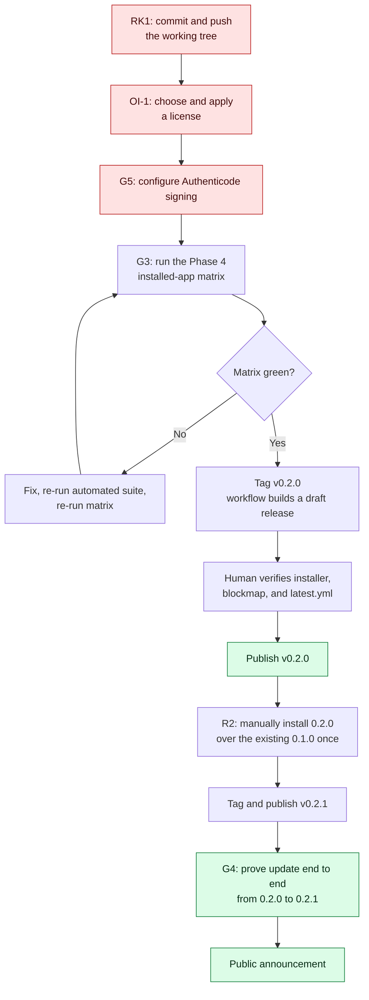

### 13.2 Release process (per `docs/updates.md`)

1. Change `version` in `package.json` **and** `package-lock.json` to a higher valid semantic version.
2. Complete the release verification matrix and commit the release.
3. Create and push the matching tag `vX.Y.Z`. The tag must exactly equal `v` + the package version or the workflow fails before publishing.
4. The `Release Windows update` workflow runs TypeScript and tests, builds the Windows installer, and uploads a **draft** release.
5. A human verifies the draft contains the NSIS installer, its blockmap, and `latest.yml`, then publishes.
6. In an older installed app, exercise **Check for updates** → download → install → relaunch.

### 13.3 One-time bootstrap

The installed **0.1.0 cannot self-bootstrap functionality it does not contain**. The reviewed 0.2.0 NSIS installer must be installed manually over it exactly once. The per-user NSIS configuration keeps the same application ID and upgrade location, so subsequent published versions use the in-app flow.

### 13.4 Support and maintenance

| Activity | Cadence | Trigger |
| --- | --- | --- |
| Re-probe Claude Code CLI surface | Per provider minor release | New `claude` version — the surface is research-preview grade |
| Re-probe Codex App Server | Per alpha bump | Currently pinned to `0.148.0-alpha.9` |
| Refresh `docs/cli-surface.md` | With each re-probe | Evidence must match the shipped parsers |
| Production dependency audit | Per release | `npm audit --omit=dev` must report 0 |
| Guard regression suite | Per change to `scripts/gates/` | Every known bypass must retain coverage |
| Full verification matrix | Per release | Phase 4 |

### 13.5 User onboarding

The first-run path is the entire onboarding surface, and it is the highest-leverage place to reduce drop-off:

1. Setup screen → Add repository → folder picker → **explicit trust confirmation**.
2. Preflight runs; any blocking dependency appears as an actionable Diagnostics card with installation instructions.
3. Catalog resolves; if the repository has no agent definitions, offer **Install Agent Pack** with a full preview.
4. Start one agent with a message — this is the activation moment (G10), and it must not require creating a Mission first.

| ID | Requirement | Priority |
| --- | --- | --- |
| FR-OP-1 | A failing preflight dependency card must include installation instructions, not just a red state. | P0 |
| FR-OP-2 | A repository with no resolvable definitions must offer the Agent Pack rather than presenting an empty roster. | P1 |
| FR-OP-3 | Nothing about the activation path (start one agent with a message) may require a Mission. | P0 |

### 13.6 Go-to-market

[TODO: not decided.] The prerequisite list is unambiguous, though: a published signed release, a real license, and at least one honest demo of the differentiated path (Mission → isolated worktrees → independent gates → exact approval → fast-forward integration). Positioning should lead with the Windows-first and accountability claims from §3.2, not with "run agents in parallel," which is table stakes in this category.

---

## 14. Open Items

| ID | Open item | Type | Owner | Blocking |
| --- | --- | --- | --- | --- |
| OI-1 | **Licensing.** The repo is public but `package.json` declares `UNLICENSED` and `private: true`. Users get no grant of rights. Choose a license (permissive, copyleft, or source-available/commercial) and apply it consistently. | Decision | Cisco | Any external adoption |
| OI-2 | **Uncommitted working tree.** The 2026-08-16 repair pass, updater, and A/B/C briefs exist only locally. | Action | Cisco | Everything |
| OI-3 | **Monetization and pricing.** Free/OSS, one-time license, or freemium with team features. | Decision | Cisco | GTM |
| OI-4 | **Analytics posture.** Local metrics view only, or opt-in telemetry? A telemetry decision is a positioning change (§11.4). | Decision | Cisco | G10, G11 |
| OI-5 | **Council lead termination policy.** Should the lead stop its background session after recording a valid result, or stay resumable? Either is acceptable; neither may leave the UI showing an endless deliberation. | Decision | Cisco | FR-CO-7 |
| OI-6 | **Which `working`/idle states accept an unsolicited message.** Must be defined and tested, not left to inference. | Decision | Cisco | FR-AG-8 |
| OI-7 | **Authenticode certificate.** Which publisher identity, and acquired how. | Action | Cisco | G5, RK4 |
| OI-8 | **ARM64 test hardware.** ARM64 payload has never run on ARM64 Windows. | Action | Cisco | G6, RK9 |
| OI-9 | **Experimental team/task parsers.** Keep as a supported surface (requires fresh shape capture) or drop. | Decision | Cisco | X7 |
| OI-10 | **Wedged-supervisor recovery text.** Capture exact text from a naturally wedged supervisor, then tighten defensive PID extraction. Do not corrupt user state to force it. | Action | Cisco | Defensive hardening |
| OI-11 | **Cross-session `SendMessage` on Windows.** Verify behavior with two independent sessions. | Action | Cisco | Agent-to-agent messaging |
| OI-12 | **Bus factor.** Single maintainer, no succession plan. | Decision | Cisco | RK3 |
| OI-13 | **Competitor verification.** §3.1 is compiled from third-party articles. Re-verify against each project's first-party docs before external positioning. | Action | Cisco | GTM |
| OI-14 | **PRD reviewer.** No reviewer assigned for this document. | Action | Cisco | PRD sign-off |
| OI-15 | **Product naming in the wild.** The repo is `Council`; the product is `Decagram Council`; `council` also names a feature and a durable Git namespace. Confirm the public-facing name before release. | Decision | Cisco | GTM |

---

## Appendix: To-Be-Completed List

> Self-check pass. Everything below is either information this PRD could not source from the repository, or a claim the repository itself explicitly declines to make.

### A.1 Information gaps in this PRD

| Chapter | Gap | What is needed |
| --- | --- | --- |
| 3 | Business model, pricing, licensing | OI-1, OI-3 |
| 3 | Competitor facts are second-hand | OI-13 |
| 4 | G10, G11 have no baseline | Telemetry decision (OI-4) or a local metrics view |
| 7 | RK3 has no mitigation | Succession plan (OI-12) |
| 11 | Analytics posture undecided | OI-4 |
| 13 | Go-to-market undefined | OI-3, OI-13, OI-15 |
| Header | No PRD reviewer | OI-14 |

### A.2 Requirements written from design intent, not from verified behavior

These are implemented and covered by automated tests, but the repository explicitly declines to claim installed-app verification. They must not be treated as proven until the Phase 4 matrix runs.

| Requirement | Why unproven |
| --- | --- |
| FR-AG-10, FR-AG-11 (recent output) | Installed-app display of live output not re-tested after the repair pass |
| FR-AG-7, FR-AG-8, FR-AG-13 (direct chat) | No installed-app interaction claimed |
| FR-CO-7 … FR-CO-11 (Council result lifecycle) | Compatibility with the completed live transcript is coded, not observed in the installed app |
| FR-MI-12 (minimal Claude-only Mission) | No live Mission has been run |
| FR-PR-6, FR-PR-7 (Codex readiness and discovery) | Handshake and a fallback probe passed; no live Codex Mission |
| FR-WS-6, FR-WS-7 (Office switching) | Three-repository switching not exercised |
| FR-AP-1, FR-AP-2 (Agent Pack install) | Not exercised in a disposable repository |
| FR-LC-3 … FR-LC-6 (update flow) | Zero releases published; no end-to-end update |

### A.3 Planned requirements with no implementation

`FR-WS-10`, `FR-MI-11`, `FR-AP-3`, `FR-AP-4`, `FR-AP-6`, `FR-PR-8`, `FR-TR-1`.

### A.4 Deliberately blocked

`FR-LC-11` / X1 — concurrent windows. Blocked until every IPC request carries and validates an exact workspace ID and runtime-registry isolation tests pass. This is a correct decision, not a gap.

### A.5 Recommended next three actions

1. **Commit and push the working tree.** (OI-2 / RK1) Everything else in this document is at risk until this is done.
2. **Resolve licensing.** (OI-1 / RK10) A public repository with no license grant cannot be adopted, regardless of quality.
3. **Run the Phase 4 installed-app matrix.** (G3 / RK5) The live Council transcript incident already proved that green automated tests do not imply a working installed application.

---

*Generated 2026-08-16 against `github.com/Code-With-Cisco/Council` at commit `73b25a7`, plus the uncommitted 2026-08-16 working tree as described in `WHAT-WAS-DONE.md`. Every requirement in Chapter 10 is traceable to a repository file; every unverified claim is marked as such.*
